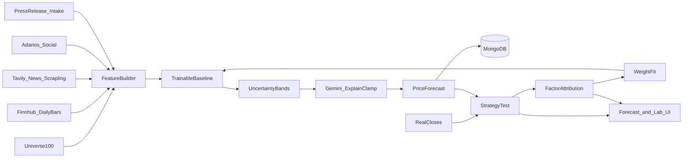

# Auto Day Trader — Architecture (prediction-first)

Fork of [OpenStock](https://github.com/Open-Dev-Society/OpenStock) (AGPL-3.0). **Primary product is swing price prediction (D1/D2/D3/D5)**, not order placement. Alpaca Approve remains in the repo but is hidden by default (`TRADING_UI_ENABLED=false`).

## Runtime pieces

| Piece | Role |
|-------|------|
| **web** (Next.js 15) | OpenStock UI + `/forecasts` + Forecast Lab `/forecasts/lab` |
| **mongodb** | Watchlists, media, FeatureSnapshots, PriceForecasts, ModelWeights, EvalRuns |
| **scrapling-worker** | Fetch/extract allowlisted news & press bodies after search-API discovery |
| **Inngest** | Post-close resolve + weekly strategy test / train (day-trader loop only if trading UI on) |



## Product surfaces

| Path | Purpose |
|------|---------|
| `/forecasts` | Watchlist D1–D5 predicted closes + 80% bands + evidence |
| `/forecasts/lab` | 100-stock strategy test, predicted vs actual, factor reports, train/promote |
| `/bot` | Redirects to `/forecasts` unless `TRADING_UI_ENABLED=true` |

## Media channels (all first-class)

| Channel | Discover | Features |
|---------|----------|----------|
| **news** | Tavily (+ Brave/SerpAPI fallback) → Scrapling | `newsCount48h`, `newsSentiment`, `newsNovelty` |
| **social** | Adanos (Reddit/X/Polymarket) when `ADANOS_API_KEY` set; else Tavily discussion snippets at lower weight | `socialSentiment`, `socialVolume`, `socialBullBearSkew`, `polymarketTilt` |
| **press** | Tavily PR queries + Finnhub/news heuristics → classify → Scrapling allowlist | `pressCount7d`, `pressSentiment`, `pressEventType`, `daysSinceLastPress` |

`MediaDocument.channel` is `news` \| `social` \| `press`. Press tilt uses `pressTiltMultiplier` (default 1.5× vs generic news) in `ModelWeights`.

## Forecast stack

1. **FeatureSnapshot** — frozen at `asOf` (no lookahead): price + news + social + press
2. **swing-baseline-vN** — blend + ridge coefficients + calibrated band `k`
3. **80% bands** — vol-scaled; Gemini may nudge `yHat` only inside `[lo80, hi80]`
4. **Strategy test** — walk-forward on `config/forecast-universe-100.json` vs real closes
5. **Factor attribution** — Spearman + grouped ablation (price/news/social/press)
6. **Train** — ridge refit on train fold; holdout last 20 days; promote if MAPE/direction gate passes

## Pricing vs prediction

- Legacy **PricingEngine** (`lib/pricing/`) remains for optional trading proposals.
- Prediction path never places orders. Gemini never invents prices outside bands.

## Key paths

| Path | Purpose |
|------|---------|
| `config/forecast-universe-100.json` | Fixed 100-name research universe |
| `lib/forecast/` | Features, media, baseline, strategy test, attribution, train |
| `lib/actions/forecast.actions.ts` | Server actions for UI + Lab |
| `scripts/strategy-test-swing.ts` | CLI strategy test |
| `lib/inngest/forecast.ts` | Post-close + weekly cron |

## Daily bars

`lib/forecast/bars.ts` tries **Finnhub `/stock/candle`** first. Free Finnhub keys often return **403** on candles — then **Alpaca market data** (if keys present) and finally the public **Yahoo chart API**. This is for prediction/research only; no live orders.

## How to run

```bash
cp .env.example .env   # Finnhub, Gemini, Tavily; ADANOS_API_KEY optional; Alpaca optional for bar fallback
npm install
npm test
npm run strategy-test:smoke   # 5 symbols × 40 days
npm run strategy-test         # full 100 × 120 days
npm run dev                   # UI: /forecasts and /forecasts/lab
```

Compose: `docker compose up --build` → `web:3000`, `mongodb`, `scrapling-worker:8091`.

## Attribution

- **OpenStock** — Open Dev Society, AGPL-3.0
- **daily_stock_analysis** — ZhuLinsen, MIT — report/news patterns adapted
- **Scrapling** — D4Vinci — article fetch worker

See `ATTRIBUTION.md`.
