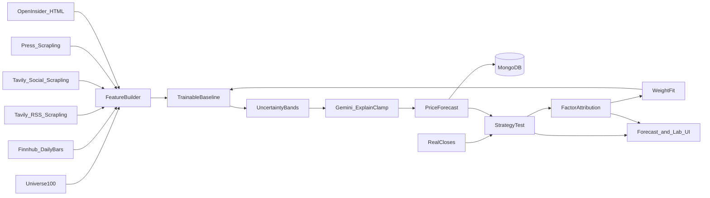

# Auto Day Trader — Architecture (prediction-first)

Fork of [OpenStock](https://github.com/Open-Dev-Society/OpenStock) (AGPL-3.0). **Primary product is swing price prediction (D1/D2/D3/D5)**, not order placement. Alpaca Approve remains in the repo but is hidden by default (`TRADING_UI_ENABLED=false`).

## Runtime pieces

| Piece | Role |
|-------|------|
| **web** (Next.js 15) | OpenStock UI + `/forecasts` + Forecast Lab `/forecasts/lab` |
| **mongodb** | Watchlists, media, InsiderFilings, FeatureSnapshots, PriceForecasts, ModelWeights, EvalRuns |
| **scrapling-worker** | Fetch/extract allowlisted news/social/press bodies; OpenInsider Form 4 HTML tables |
| **Inngest** | Post-close resolve, weekly strategy test/train, daily/midday insider scan (day-trader loop only if trading UI on) |



## Product surfaces

| Path | Purpose |
|------|---------|
| `/forecasts` | Watchlist D1–D5 predicted closes + 80% bands + news/social/press/insider evidence |
| `/forecasts/lab` | 100-stock strategy test, predicted vs actual, factor reports (incl. **insider** channel), train/promote |
| `/bot` | Redirects to `/forecasts` unless `TRADING_UI_ENABLED=true` |

## Media + insider channels (all first-class)

| Channel | Discover → fetch → score | Features |
|---------|--------------------------|----------|
| **news** | Tavily (+ Brave/SerpAPI) → Scrapling → VADER/lexicon | `newsCount48h`, `newsSentiment`, `newsNovelty` |
| **social** | Tavily discussion queries + public RSS → Scrapling on allowlisted public URLs → local VADER (**no Adanos**, no login walls) | `socialSentiment`, `socialVolume`, `socialBullBearSkew` |
| **press** | Tavily PR queries + Finnhub/news heuristics → classify → Scrapling allowlist | `pressCount7d`, `pressSentiment`, `pressEventType`, `daysSinceLastPress` |
| **insider** | OpenInsider HTML (cluster buys, purchases ≥ $25k, per-ticker) via Scrapling → `InsiderFiling` upsert | `insiderBuyValue7d`, `insiderBuyCount7d`, `insiderClusterBuy`, `insiderCeoCfoBuy`, `insiderNetValue30d`, `daysSinceLastInsiderBuy` |

`MediaDocument.channel` is `news` \| `social` \| `press`. Insider rows live in **`InsiderFiling`** (not MediaDocument). Press/insider tilts use multipliers in `ModelWeights` and share `eventTiltCap`.

Ingest: `POST /api/media/ingest` and `POST /api/insider/ingest` (worker-token auth).

## Forecast stack

1. **FeatureSnapshot** — frozen at `asOf` (no lookahead): price + news + social + press + insider
2. **swing-baseline-vN** — blend + ridge coefficients + calibrated band `k`
3. **80% bands** — vol-scaled; Gemini may nudge `yHat` only inside `[lo80, hi80]`
4. **Strategy test** — walk-forward on `config/forecast-universe-100.json` vs real closes
5. **Factor attribution** — Spearman + grouped ablation (price/news/social/press/**insider**)
6. **Train** — ridge refit on train fold; holdout last 20 days; promote if MAPE/direction gate passes

## Pricing vs prediction

- Legacy **PricingEngine** (`lib/pricing/`) remains for optional trading proposals.
- Prediction path never places orders. Gemini never invents prices outside bands.
- Insider signals are **prediction features / Lab attribution only** — no auto-trade.

## Key paths

| Path | Purpose |
|------|---------|
| `config/forecast-universe-100.json` | Fixed 100-name research universe |
| `lib/forecast/` | Features, media, insider, baseline, strategy test, attribution, train |
| `lib/forecast/insider.ts` | InsiderFiling → FeatureSnapshot + evidence lines + event tilt |
| `services/scrapling-worker/openinsider.py` | OpenInsider tinytable parsers + fixtures |
| `lib/actions/forecast.actions.ts` | Server actions for UI + Lab |
| `scripts/strategy-test-swing.ts` | CLI strategy test |
| `lib/inngest/forecast.ts` | Post-close + weekly cron |
| `lib/inngest/insider.ts` | Daily/midday OpenInsider scan + forecast refresh |

## Daily bars

`lib/forecast/bars.ts` tries **Finnhub `/stock/candle`** first. Free Finnhub keys often return **403** on candles — then **Alpaca market data** (if keys present) and finally the public **Yahoo chart API**. This is for prediction/research only; no live orders.

## How to run

```bash
cp .env.example .env   # Finnhub, Gemini, Tavily; Scrapling worker for bodies + OpenInsider
npm install
npm test
cd services/scrapling-worker && python3 -m unittest test_openinsider -v
npm run strategy-test:smoke        # 5 × 40, price-only (fast)
npm run strategy-test:smoke:live   # 5 × 40 + live news/social/press/insider on latest asOf
npm run strategy-test              # 100 × 120 price-only
npm run strategy-test:live         # 100 × 120 + live media (slow / rate-limited)
npm run dev                        # UI: /forecasts and /forecasts/lab
```

Walk-forward asOf dates use `lib/forecast/calendar.ts` (weekdays + NYSE holiday skip; no lookahead).

Compose: `docker compose up --build` → `web:3000`, `mongodb`, `scrapling-worker:8091`.

## Attribution

- **OpenStock** — Open Dev Society, AGPL-3.0
- **daily_stock_analysis** — ZhuLinsen, MIT — report/news patterns adapted
- **Scrapling** — D4Vinci — article fetch worker
- **OpenInsider** — public Form 4 HTML screener (scraped; no paid API)
- **vader-sentiment** — local polarity for media features

See `ATTRIBUTION.md`.
