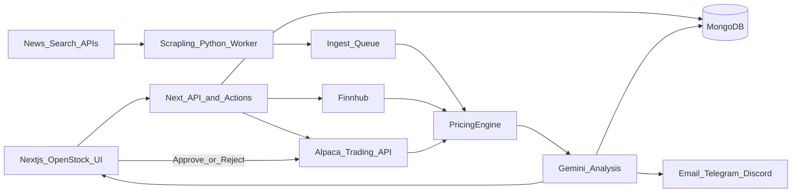

# Auto Day Trader — Architecture

Fork of [OpenStock](https://github.com/Open-Dev-Society/OpenStock) (AGPL-3.0) with human-approved Alpaca paper trading, Scrapling news intake, and a DSA-shaped decision dashboard.

## Runtime pieces

| Piece | Role |
|-------|------|
| **web** (Next.js 15) | OpenStock UI + `/bot` decision dashboard + Approve/Reject trading |
| **mongodb** | Watchlists, media, pricing, reports, proposals, audit |
| **scrapling-worker** | Fetch/extract allowlisted article bodies after search-API discovery |
| **Inngest** | Market-hours loop, market review, proposal notifications (no auto-submit) |



## Data contracts

- **MediaDocument** — discovered + Scrapling-enriched articles (`database/models/media-document.model.ts`)
- **PricingSnapshot** — deterministic entry/stop/targets from VWAP/ATR/microstructure/relative/event (`lib/pricing/`)
- **AnalysisReport** — DSA-shaped score/action/trend/catalysts/risks/checklist (`database/models/analysis-report.model.ts`)
- **TradeProposal** — priced idea; lifecycle `proposed → approved|rejected → submitted|failed`
- **OrderAudit** — immutable audit of approvals and submissions
- **MarketReview** — indices + sector leaders/laggards snapshot

## Pricing rule

`PricingEngine` (`lib/pricing/engine.ts`) is authoritative. Gemini may refine within `entryZone` / target bands via `clampProposalToPricing` — it never invents fill prices from headlines alone.

## Trading safety

1. Default `ALPACA_MODE=paper`
2. Live requires `ALPACA_ALLOW_LIVE=true` + UI confirm phrase
3. Cron / Inngest **only creates proposals and notifies** — never calls `submitOrder`
4. `approveProposalAction` is the only path to Alpaca; requires explicit click
5. Kill switch, max position %, max daily proposals, one open proposal per symbol

## Key paths

| Path | Purpose |
|------|---------|
| `app/(root)/bot` | Decision dashboard |
| `services/scrapling-worker/` | Python FastAPI + Scrapling |
| `lib/actions/daytrader.actions.ts` | Intake → price → analyze → propose |
| `lib/actions/trading.actions.ts` | Approve / Reject / settings |
| `lib/inngest/daytrader.ts` | Market-hours + pre/post review crons |
| `lib/alerts/notify.ts` | Email / Telegram / Discord |

## Attribution

- **OpenStock** — Open Dev Society, AGPL-3.0 (this fork remains AGPL)
- **daily_stock_analysis** — ZhuLinsen, MIT — report/news/notification product patterns adapted (not a code copy of the FastAPI WebUI)
- **Scrapling** — D4Vinci — article fetch worker

See `ATTRIBUTION.md`.

## Compose

```bash
cp .env.example .env   # fill keys
docker compose up --build
```

Services: `web:3000`, `mongodb:27017`, `scrapling-worker:8091`.

Without Docker: run Mongo separately, `npm run dev`, and `uvicorn` the worker from `services/scrapling-worker`.
